# 数据光盘刻录指南

[网页版](https://nanocm.github.io/optical-disc-writing-guide/) · [写入行为记录（Markdown）](experiment-notes.md) · [授权与图片来源](LICENSE.md)

本文基于 Bedcore《数据光盘刻录理论入门》V1.0.2 改写，按 [CC BY-SA 3.0](https://creativecommons.org/licenses/by-sa/3.0/deed.zh-hans) 分享。[Bedcore 的视频](https://www.bilibili.com/video/BV1itur6qExK/)是基础版本的获取入口。产品、固件与软件资料核查于 2026-10-06。

备好文件后，可直接从第五章的刻录步骤读起；遇到盘型、光驱或兼容性问题，再查前四章。

| 要做什么 | 介质与写入方式 | 写完怎样确认 |
| --- | --- | --- |
| 备份已整理好的一批文件 | DVD±R／BD-R；用 ImgBurn `Write files/folders to disc` 一次写入 | Verify、弹出重插、逐文件哈希 |
| 制作 Linux 安装盘或恢复盘 | 容量足够的空白盘；用 `Write image file to disc` 按原镜像写入 | 核对下载哈希、刻后校验，并在目标电脑试启动 |
| 分几周陆续添加文件 | Windows Live 或已验证可导入旧会话的刻录软件 | 每次重插后同时打开旧文件与新文件 |
| 经常修改、删除和复用 | DVD±RW／BD-RE；先测试所选 UDF 写入模式 | 保存、弹出、重插、读回，再测试擦除 |
| 长期保存不可替代的资料 | 固定快照与校验清单，至少两份放在不同地点或介质上 | 定期重读，并在设备或介质老化前迁移 |

将 `movie.mkv` 复制到 DVD，只会得到数据盘；DVD-Video 需要另做编排。安装镜像也要按镜像写盘，直接复制 `linux.iso` 不会做出启动盘。[[S5]](#source-s5)[[S6]](#source-s6)

## 一、盘片容量、记录层与保存条件

### 1.1 盘片容量与记录层

CD、DVD、BD 分别用近红外、红光、蓝紫光读写。`R` 通常表示一次写入，`RW`、`RE`、`RAM` 表示可重写；`DL`、`TL`、`QL` 是双层、三层、四层。50 GB BD-R DL 是双层盘，100 GB 三层和 128 GB 四层盘属于 BDXL。光驱对 BD-R DL、BDXL 和 UHD 电影的支持需要分别确认。[[S3]](#source-s3)

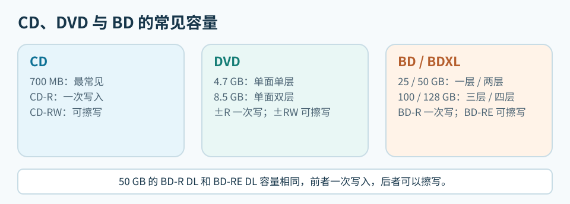

*容量、层数和可擦写性是三个不同的属性。图中列出常见规格，完整容量见下表。*

单层盘有一个记录层位，双层盘在同一读盘面下有两个，光头改变焦点深度来选层。只读盘的数据是模压凹坑；一次写入盘和可擦写盘在记录材料中形成标记。下面的剖面从印刷面画到读盘面，双面 DVD 两面都可读。薄膜已放大，色块高度不代表实际厚度。[[S14]](#source-s14)[[S15]](#source-s15)

“数据面”通常指朝向光头的读盘面；数据并不直接露在表面。CD 的记录区贴近印刷面，DVD 在盘体中间，BD 则靠近读盘面。[[S14]](#source-s14)[[S15]](#source-s15)

#### CD：记录区靠近印刷面

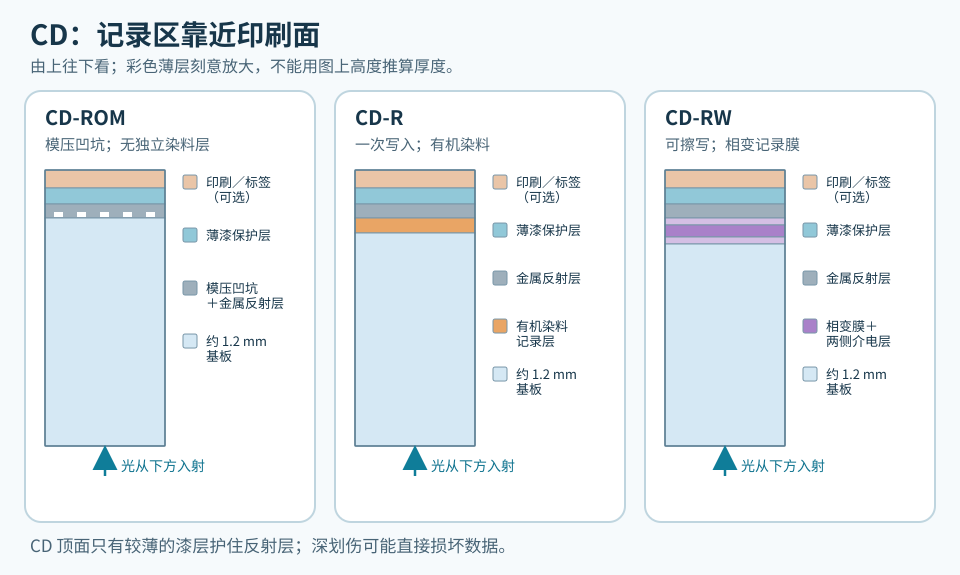

*CD-ROM 的凹坑模压在基板上；CD-R 用有机染料，CD-RW 用相变膜。三者都从基板一侧读盘。印刷面下的漆层较薄，顶面深划伤可能伤及反射层。[[S14]](#source-s14)*

CD-RW 的相变膜通常夹在介电层之间；CD-R 的染料和金属反射层分开。印刷层可有可无，不能代替保护记录区的薄漆。[[S14]](#source-s14)

#### DVD：记录区在两片基板之间

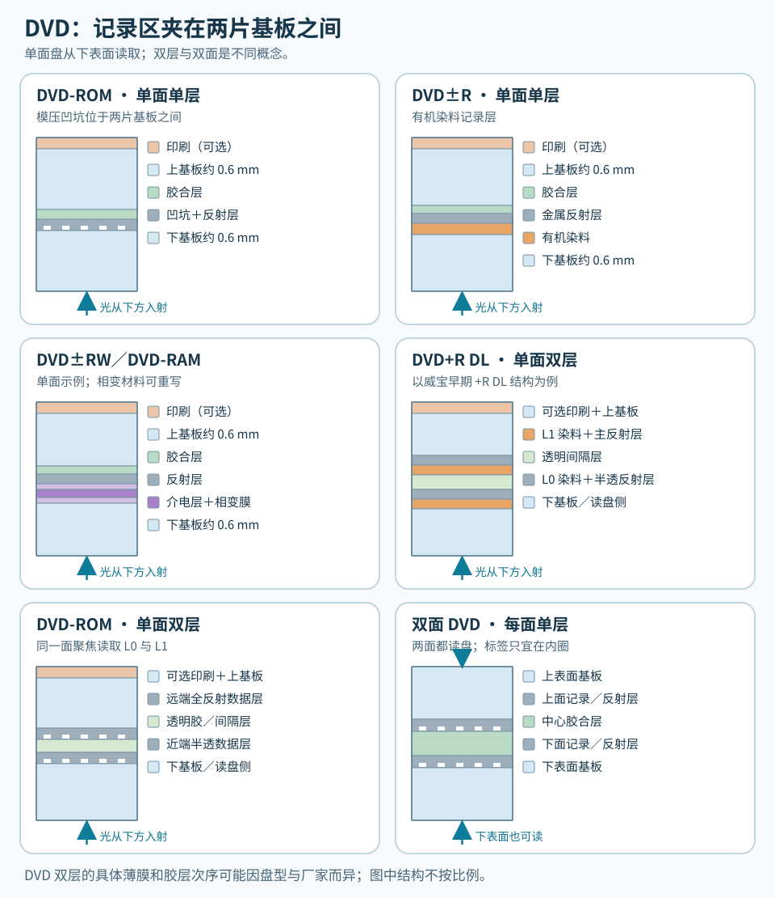

*单面 DVD 的两片基板在中心胶合，读盘光线从下方进入。双层盘的近端层须半透明，光头才能聚焦更深一层；双面盘两面都有读盘面，通常只能在内圈贴小标签。[[S14]](#source-s14)[[S17]](#source-s17)*

单层 DVD±R 通常用有机染料，DVD±RW 与 DVD-RAM 用相变材料，只读 DVD 使用模压凹坑。图中的 DVD+R DL 是早期威宝／三菱结构：靠近读盘面的 L0 有半透反射层，激光穿过它聚焦到 L1。双层 DVD-ROM 也有其他层序。双层盘从同一面读取两层；双面盘则要翻面，两种结构可以组合。[[S14]](#source-s14)[[S17]](#source-s17)

#### BD：记录区靠近读盘面

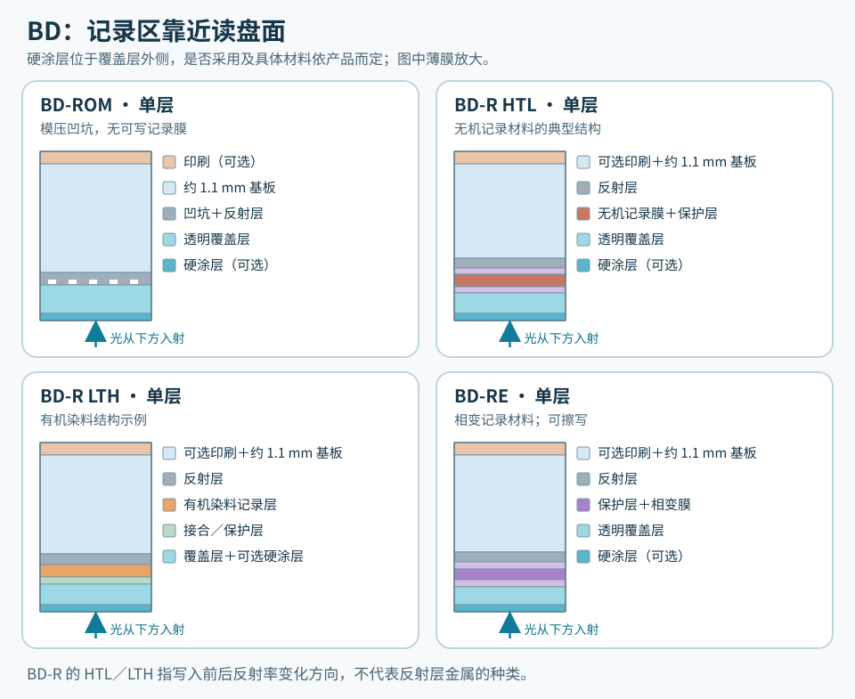

*BD 的读写光线从约 0.1 mm 透明覆盖层一侧进入；外面的硬涂层是表面防护，不是记录层。图中的 BD-R 薄膜层序只是技术白皮书所示例子，各厂家材料和层数可能不同。[[S15]](#source-s15)[[S16]](#source-s16)[[S18]](#source-s18)*

BD-ROM 使用模压凹坑；BD-R HTL 常用无机材料，LTH 用有机染料，BD-RE 用相变材料。BD 的厚基板在印刷侧，光线从约 0.1 mm 的覆盖层进入，故读盘面上的灰尘和划伤更值得留意。“Hard Coat”是表面硬涂层，不是数据层；HTL／LTH 也不说明反射层用了什么金属。[[S15]](#source-s15)[[S16]](#source-s16)[[S18]](#source-s18)

#### BD 双层与 BDXL

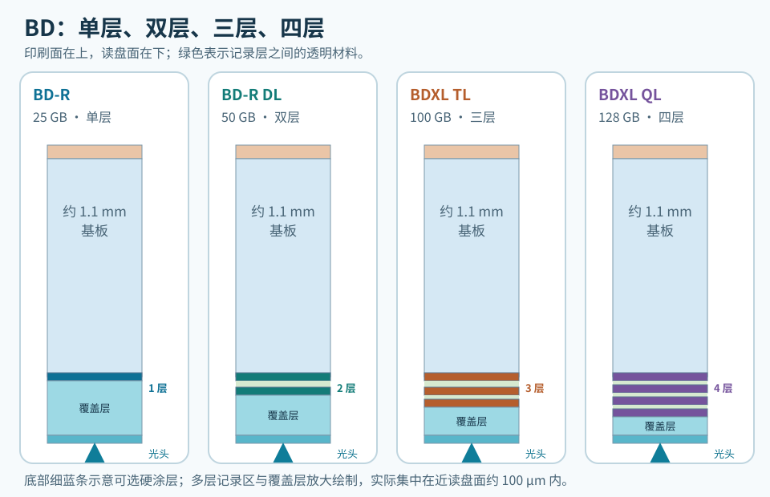

*四种盘都从同一面读盘。光头穿过近端的半透层和透明间隔层，聚焦更深的层；图把近读盘面的薄结构放大。[[S15]](#source-s15)[[S16]](#source-s16)[[S18]](#source-s18)*

BD 单层记录区距读盘面约 100 µm。双层盘的 L0 约 100 µm、L1 约 75 µm；BD-RE 三层示例中的 L2 约 57 µm。三层、四层盘仍把各层置于读盘面附近，以透明材料间隔，具体尺寸随规格变化。层数增加也提高了聚焦和层间串扰的要求。[[S15]](#source-s15)[[S16]](#source-s16)[[S18]](#source-s18)

标准 12 cm 盘的常见容量如下。容量相同的 R 与 RW／RE 仍是不同盘型。

| 标称容量 | 常见盘型 | Windows 约显示 |
| --- | --- | ---: |
| 700 MB | CD-R、CD-RW | 667 MiB |
| 4.7 GB | DVD±R、DVD±RW、DVD-RAM、DVD M-DISC | 4.38 GiB |
| 8.5 GB | DVD±R DL；双层可擦写盘少见 | 7.92 GiB |
| 25 GB | BD-R、BD-RE | 23.3 GiB |
| 50 GB | BD-R DL、BD-RE DL | 46.6 GiB |
| 100 GB | BD-R TL、BD-RE TL | 93.1 GiB |
| 128 GB | 主要是 BD-R QL；BD-RE QL 须查具体产品 | 119.2 GiB |

小尺寸和双面盘也曾使用：Mini CD 约 215～310 MB；Mini DVD 单面可为 1.46 GB 或 2.66 GB；Mini BD-R 约 7.8 GB。标准直径的双面单层 DVD 为 9.4 GB，双面双层约 17 GB；部分 DVD-RAM 需要翻面。旧款 CD 还常见 650 MB。小盘须确认光驱托盘能固定 8 cm 介质，双面盘须分清每一面的容量。企业级双面 BD 有约 200 GB 和更高容量方案，不能拿来推断消费级 BDXL 光驱的能力。

GB 按十进制计算（10⁹ 字节），GiB 按二进制计算（2³⁰ 字节）。文件系统、备用区和会话也占空间。写盘前用 ImgBurn Disc Information 核对 Profile、容量、层数、速度和 MID；光驱须支持对应的 `+`／`-`、RAM、双层或 BDXL 写入能力。

不同盘型的倍率不能直接比较。4× 的数据率约为 CD 0.6 MB/s、DVD 5.54 MB/s、BD 18 MB/s。DVD M-DISC 需要光驱提供相应写入策略；BD M-DISC 通常按对应容量的 BD-R 写入，但仍应核对光驱的可写 Profile 和兼容表。常见 BD-RE 零售盘多为 2× 写入，具体速度以实盘和光驱报告为准。

### 1.2 续写、覆写和重写

DVD-R、DVD+R、BD-R 的已写区域无法擦除。有剩余空间时，可以追加文件或将同名新版写在新位置，但旧版仍占空间。DVD±RW、BD-RE 可擦除和覆写；编辑器能否直接保存，还要看记录模式、UDF 布局、系统和软件。[[S4]](#source-s4)[[S10]](#source-s10)

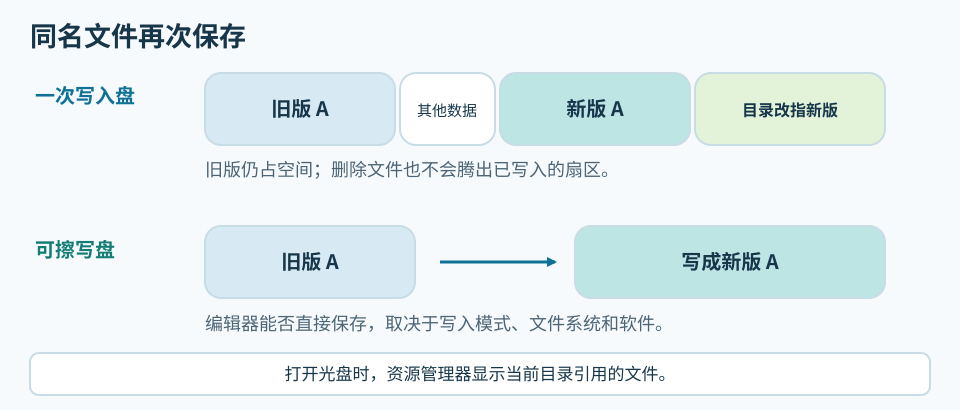

*“文件名被替换”描述的是当前目录，不代表旧数据在物理盘面上被抹掉。*

BD-RE、DVD-RW 往往比对应的 `R` 盘慢。它们的相变记录层需要在晶态和非晶态之间反复切换，写入功率与脉冲也要兼顾多次使用。一次写入盘只需形成稳定的记录标记，因此厂商可以采用不同的高速写入策略。慢速盘的质量仍要靠写后读回来判断。

盘片主要用聚碳酸酯作基板；记录层、反射层、涂层、胶合和制造公差也影响可读性。BD 有更强的纠错设计，但不能弥补所有制造或写入缺陷。

`DVD-R` 是 Pioneer 主导的 DVD Forum 路线，`DVD+R` 由 Sony、Philips 等推动的联盟发展；早期固件和播放器对两者的支持有别。部分刻录机可把 `DVD+R/+RW` 的 `Book Type` 设为 `DVD-ROM`，供旧播放器识别，但盘片仍是加号格式。给老设备用盘，应按具体 MID 试刻、试读；双层 DVD 还要检查跨层位置。

### 1.3 染料、相变层、HTL／LTH、M-DISC

普通 CD-R、DVD±R 多用有机染料。酞菁、花青和偶氮（AZO）是不同染料；CD-R 的金、银或合金反射层又是另一层结构。三菱／威宝的 AZO 标识有助于辨认系列，却不说明完整配方或寿命。没有厂商材料说明，不能凭“金盘”名称、MID 或盘底颜色鉴定成分。

BD-R 的 HTL（High to Low）与 LTH（Low to High）表示刻后反射率的变化方向。HTL 常用无机材料，LTH 通常用有机染料；这与 UDF 版本、可擦写性无关。威宝的 `VERBAT IMe` 与 `VERBAT IMu` 同为 25 GB、1～6×，却分别是 HTL、LTH。可在 ImgBurn 中查看 `Recorded Mark Polarity`，并用 MID 名录核对。[[S2]](#source-s2)

Juri 的[户外对照](http://juri.su/lthhtl.htm)比较了威宝 `43751 / VERBAT IMu`（LTH，盘片标为 2011 年）与 `43742 / VERBAT IMe`（HTL，标为 2016 年）。两盘于 **2021 年 3 月 31 日**由 Pioneer BDR-211UBK 以 2× 写入，放在朝西南的室外窗台；之后每月用 LG BH16NS40 以 7× 扫描。189 天后的 10 月 6 日，两盘退化速度相近且都通过读取测试。[[S9]](#source-s9) 标注年份不是刻录年份，空白盘存放时间也不同。这项双盘实验无法给 HTL、LTH 排寿命；普通备份可优先考虑 HTL，并检验到手批次。

DVD M-DISC 主打耐久的无机记录层，需要刻录机提供相应写入策略。BD-R 本来就有无机 HTL 盘，BD M-DISC 是其中的品牌系列，材料和寿命宣传不能直接沿用 DVD 版。Juri 的[样本目录](http://juri.su/mdisc.htm)列有 RITEK `MDDVD47 / MILLENIA 001`、2014 年 RITEK `MDBD25 / MILLEN MR1`，以及 2016 年威宝 `DBR50RMDPV1 / VERBAT IMf`、`DBR100YMDPV1 / VERBAT IMk`。[[S9]](#source-s9) 同一商标涵盖不同容量和 MID，代码也不证明记录层相同；“只有三四家厂生产”缺少逐型号依据。

### 1.4 保存寿命、材料标识与存放条件

加拿大文物保护研究所（CCI）的参考寿命表按材料和特定温湿度研究给出范围，**未计入空气污染物**；非金反射层在污染环境中可能更早失效。年数不能直接套到某个品牌或批次。[[S13]](#source-s13)

| 参考年限 | CCI 表中的介质及材料 |
| --- | --- |
| 超过 100 年 | 酞菁染料＋金反射层 CD-R |
| 50～100 年 | 酞菁染料＋银合金反射层 CD-R；金反射层 DVD-R；只读 CD |
| 20～50 年 | CD-RW；BD-RE；银合金反射层 DVD+R；花青或偶氮染料＋银合金反射层 CD-R；DVD+RW |
| 10～20 年 | 无染料＋金反射层 BD-R；银合金反射层 DVD-R；只读 DVD／BD |
| 5～10 年 | 染料或无染料、单层或双层 BD-R；DVD-RW；DVD+R DL |

CCI 建议存放于相对湿度 20%～50%、温度 −10～23°C，避免超过 32°C；这是保存建议，**不是表中统一的测试条件**。家中应避开日晒、暖气、潮湿和灰尘，独立入盒，定期读盘。[[S13]](#source-s13)

BD-R 在表中落入不同范围，取决于记录层、反射层等材料。纠错和缺陷管理也影响可读性，多层、可擦写盘还对读盘设备有额外要求。短期扫描或单盘暴露试验无法给所有 HTL、LTH 或产地排出寿命顺序。[[S9]](#source-s9)[[S13]](#source-s13)

“Archival”“Gold”“Medical”“M-DISC”“Hard Coat”可能指材料、涂层或产品系列，须查厂商说明。ISO/IEC 16963 加速老化测试比较设定条件下的样本失效趋势，不能保证单张盘的可读年数。可按公开的染料、反射层和测试条件比较专业盘；普通零售盘若缺少材料声明，就记录商品号与批次，读回校验并留第二副本。

外观可留下批次线索，不能用来鉴定材料。BD-R 和 BD-RE 的记录层与堆叠结构不同，盘底可能分别呈金棕色、黑紫色等颜色。标准 12 cm CD／DVD／BD 的名义厚度都在约 1.2 mm 量级。边缘、标签和公差会影响手感，凭厚薄不能判定工厂或寿命。

桶装盘沿中心轴叠放，取盘时避免让一张盘的记录面在另一张盘面上滑动。已刻好的归档盘可放进独立珍宝盒，详细信息写在盒子上。若要在盘面标记，只在厂商允许的区域使用合适的软头笔；厚标签可能影响转动平衡。

### 1.5 MID 与盘片批次

MID 是介质控制信息中的制造商／类型代码，光驱固件据此选择写入策略。它不等于商标、工厂、材料或批次质量。追溯盘片时，应连同商品号、包装上的产地与厂商声明、内圈码、卖家、购买日期及刻录日志一起记录。[[S2]](#source-s2)[[S8]](#source-s8)

蓝光协会的[MID 名录](https://blu-raydisc.info/licensee-list/discmanuid-licenseelist.php)按 BD-R 层数、BD-RE 等盘型列出授权代码和标称速度，供辨认代码，不评价零售盘质量。[[S2]](#source-s2)

| MID 前段 | 名录中的盘型与速度 |
| --- | --- |
| `VERBAT-IMe`／`VERBAT-IMu` | 25 GB BD-R，1～6×；分别为 HTL、LTH |
| `VERBAT-IMf`／`VERBAT-IMk` | 50 GB BD-R DL、100 GB BD-R TL；均为 HTL |
| `RITEK-BR2`／`RITEK-BR3` | 25 GB BD-R HTL；分别为 1～4×、1～6× |
| `RITEK-BO1`／`RITEK-BO2` | 25 GB BD-R LTH；分别为 1～4×、1～6× |
| `RITEK-DR3`／`CMCMAG-CN2` | 50 GB BD-R DL HTL；25 GB BD-RE 2× |

这些数字标识盘型或速度代际，不是质量等级；BD-R 与 BD-RE 的误码或寿命也不能直接对比。

名录把 `VERBAT IMe` 同时列在 CMC Magnetics 和 Mitsubishi Chemical Media 名下。[ez647 的 2011 年 Verbatim 43714 样本](https://ez647.sk/mitsubishi_kagaku/verbatime000bdr.html)读到 `VERBAT-IMe-000`，内圈码为 `ZE4635-MK-BX6A031`，并标为台湾 CMC 制造。手中 `43714` 若有同样内圈码，比共用的 MID 更能指向该生产线；包装上的三菱商标声明仅说明商标权属。精确批次仍可向厂商核实。[[S2]](#source-s2)[[S8]](#source-s8)

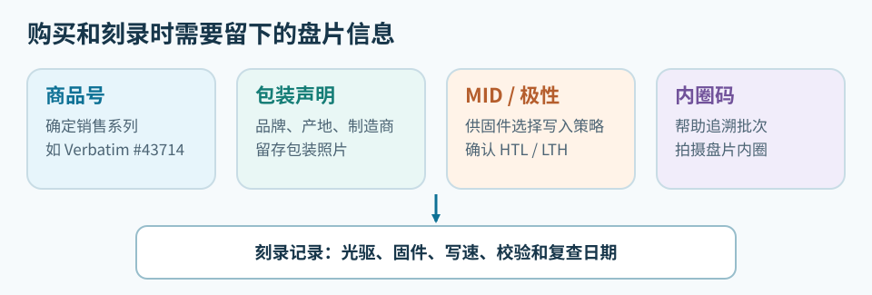

*MID 是识别线索之一。要追溯到手的盘，还需保存包装和批次资料。*

BD 扫描常看 LDC（长距离码错误）和 BIS（Burst Indicator 子码错误）；DVD 常看 PI Errors、PIF（PI Failure）和 jitter（时基抖动）。扫描曲线可以找出错误突然升高的区域，但同一张盘换光驱、固件或扫描速度，数值都可能变化。要确认备份当前可用，还应完整读回、比较文件哈希，并在一段时间后复查。[[S8]](#source-s8)[[S9]](#source-s9)

### 1.6 质量扫描的时间与设备条件

Juri 的 [BD-R 测试表](http://juri.su/bdrtest.htm)列有照片、扫描图、平均／最大 LDC 与 BIS、抖动、写速和 `Data` 日期。其中三张 `CMCMAG BA5` 25 GB 盘的数据是：[[S9]](#source-s9)

| 样本及盘片年份 | `Data` 栏日期 | 表中写速 | 平均 LDC | 平均 BIS |
| --- | --- | ---: | ---: | ---: |
| Verbatim `43840`，盘片标为 2016 年 | 2020-02-29 | 3× | 10.47 | 0.15 |
| Verbatim `43804`，盘片标为 2016 年 | 2018-01-27 | 6× | 21.86 | 0.36 |
| CMC `BDR25`，盘片标为 2016 年 | 2019-02-17 | 6× | 74.20 | 1.02 |

同一 MID 的三张盘数值差距明显，但写速、批次不同，`Data` 也未区分刻录日和扫描日，不能由“2016 年盘片”推算写后存放年数。原页所列刻录机为 Pioneer BDR-S09XLT；2017 年 5 月后主要用刷 WH16NS58 固件的 LG BH16NS40(NS51) 测试，更早还用过 ASUS BC-08B1ST。自行比较时要固定扫描机、固件及扫描速度，观察曲线在哪个盘面位置升高；低误码只表示当次读回余量较好，不能换算寿命。恢复资料仍以完整读回和文件校验为准。[[S9]](#source-s9)

ez647 的 [Imation `RITEK-BR2` 样本](https://ez647.sk/ritek/ritekbr2000_bdr.html)于 2011-04-24 刻录并通过首次读取，2012-05-13 复测已无法读文件，间隔 **385 天**。[Verbatim `43714 / VERBAT IMe`](https://ez647.sk/mitsubishi_kagaku/verbatime000bdr.html)标注 2011-04-23 刻录、当日测试及 2012-05-13 复测，但未列出更久后的状态。[[S8]](#source-s8) 讨论写后变化，须分清盘片年份、刻录日和复测日；单次扫描只说明当时的状况。

## 二、光驱的读写能力

### 2.1 机芯尺寸与连接方式

光驱按机芯可分为 5.25 英寸厚机和约 9／12 mm 的薄机；外置 USB 产品则可能装着其中任一种。厚机通常更适合连续刻录和多层盘。薄机写单层盘也够用，实际表现还看供电、散热、固件和盘片。

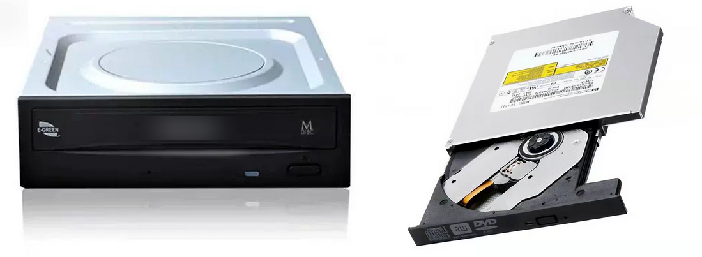

*两种内置机芯*

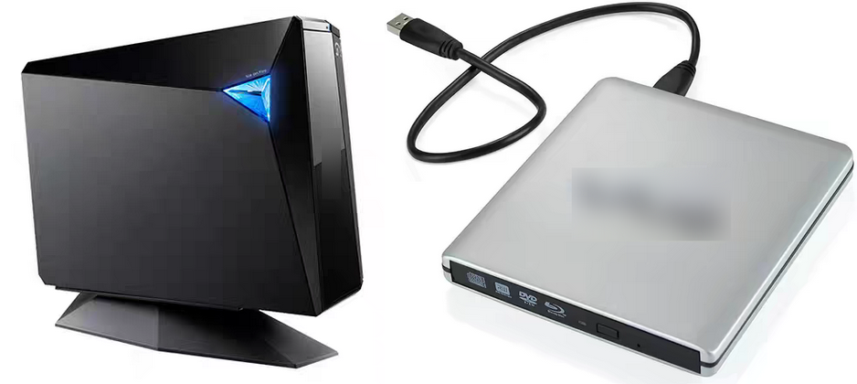

*两种外置形态*

### 2.2 面板标志与实际 Profile

“蓝光刻录机”有时只能写 25／50 GB BD，有些还能写 BDXL。查看完整型号、硬件修订、固件、连接方式和设备的 `Profiles`，分别确认 DVD±R／DL／RAM、BD-R DL 及各层 BDXL 的写入能力。ImgBurn 报告 `Found 1 BD-RE XL` 只说明发现相关 Profile，不能推及所有 XL 盘型。读取 UHD 电影盘、商业软件的 AACS 2.x 播放链，以及质量扫描所需的厂商命令，也各要单独验证。[[S3]](#source-s3)

外置盒增加一道 USB 桥接。若软件认出内部 `ASUS BW-16D1HT`，却报告 USB 2.0，应查 Windows 设备树的协商速度、盒体规格和连续读取曲线。只换电脑接口未必改变桥接方式，USB 2.0 也可能限制高倍速 BD 读写。

面板上的 `CD-RW`、`DVD Multi Recorder`、`BD-RE` 通常提示写入能力；`DVD-ROM`、`DVD Multi Player`、`BD-ROM` 提示读取能力。`BD Combo` 通常刻 CD／DVD、只读 BD，刷固件也无法增添 BD 写入硬件。方框式 `RW` 是 DVD 加号格式标志；CD-RW 的 High Speed／Ultra Speed 表示速度类别。面板可能被替换，仍须核对 Profile。


*CD*

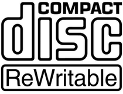

*CD-RW*

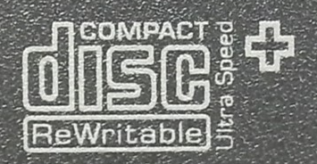

*CD-RW Ultra Speed+*

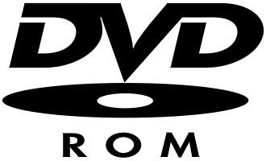

*DVD-ROM*

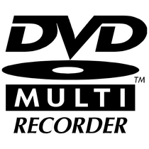

*DVD Multi Recorder*

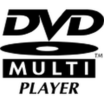

*DVD Multi Player*

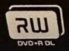

*DVD+R DL*

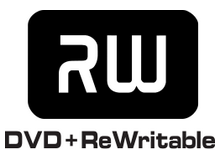

*DVD+RW*

DVD M-DISC 标志提示光驱为原始 DVD M-DISC 准备了写入策略。HD DVD 曾与 BD 竞争，如今介质和设备都少见。`Blu-ray Disc` 表示蓝光家族，`BDXL` 对应三层或四层的大容量盘，`Ultra HD Blu-ray` 则涉及电影播放规范。选购时应分别核对 BDXL 的读写 Profile，以及商业 UHD 播放所需的软件和 AACS 条件。[[S3]](#source-s3)


*M-DISC 纵向*

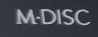

*M-DISC 横向*


*HD DVD*


*Blu-ray Disc*


*BDXL*

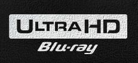

*Ultra HD Blu-ray*

华硕 E-GREEN 涉及电源／静音管理，明基 SolidBurn 尝试为未知盘片优化写入策略。LightScribe 和 LabelFlash 曾用激光在特定盘面上刻印标签。这些标志与数据面的纠错能力或保存年限无关。

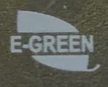

*E-GREEN*

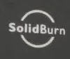

*SolidBurn*

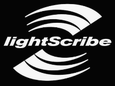

*LightScribe*


*LabelFlash*

### 2.3 光驱类型与可写盘型

`CD-ROM`、`DVD-ROM` 是只读机；`CD-RW` 可写 CD，`DVD-RW／DVD±RW` 通常可写 CD 和 DVD。`BD-ROM` 以只读 BD 为主，通常不刻 CD／DVD；`BD Combo` 通常读 BD、刻 CD／DVD；`BD-RE` 刻录机还能写 BD。

标称 BDXL 的 Combo 机可能只读 XL，BD 刻录机也未必能写每种 XL 盘。DVD±R DL、DVD-RAM、BD-RE TL 等细项都要查各自的读写 Profile。

某些刻录机支持将 `DVD+R/+RW` 的 `Book Type` 设为 `DVD-ROM`，改善旧播放器识别；盘仍是加号格式。播放还取决于文件系统和 DVD-Video 结构。

### 2.4 历代代表机型

从 CD 到 BD 的代表型号包括：CD 时代的 Plextor Premium、Yamaha CRW-F1；DVD 时代的 Plextor PX-716A／PX-760A、BenQ DW1620／DW1640／DW1650、Pioneer DVR-111、Sony Optiarc AD-7280S／TEAC DV-W5500S；BD 时代的 Pioneer BDR-S13J-X／BDR-213JBK、Lite-On iHBS112／212／312、HLDS WH16NS60。今天购买 CD／DVD 时代老机时，激光器、皮带、主轴和电容的状态比旧日口碑更重要。OEM 机芯、产线和主控也可能随硬件修订改变。

### 2.5 光驱寿命与写入速度

消费光驱通常没有可靠的“最多刻多少张”额定值。激光器、机械件、积尘、散热和供电都会影响寿命。可记录同一 MID、同一速度下的失败率、Verify 及读取曲线：只有一张旧盘难读，先查盘；多种良盘均出错，再查光驱。

固件只为部分盘片和速度组合准备写入策略。现代 16× DVD 强制降到极低速度可能更差。新批次先选双方支持的中档速度试刻，保留日志，Verify、重插读回。比较写速时，扫描机和扫描速度要固定。[[S8]](#source-s8)

### 2.6 UHD Friendly、官方 UHD、LibreDrive 与刷机

MakeMKV 社区把能借助相应固件读取 UHD 光盘原始数据、但不属于官方 UHD 播放链的部分机型称为 **UHD Friendly**；`WH16NS60`、`BU40N` 等被列在 **Official** 路线。**LibreDrive** 是 MakeMKV 显示的原始访问能力状态，不是机型标志。即使刷入 Official 路线固件，PowerDVD 等商业播放器所需的 AACS 2.x 资格也不会自动出现。[[S3]](#source-s3)

[MakeMKV 社区指南](https://forum.makemkv.com/forum/viewtopic.php?f=16&t=19634)列出的部分机芯如下。目标固件是社区读取方案，并非厂商升级建议。[[S3]](#source-s3)

| 机芯 | 类别 | 指南所列固件及条件 |
| --- | --- | --- |
| ASUS `BW-16D1HT`／`BW-16D1HT Pro`，5.25 英寸 | Friendly | `BW-16D1HT 3.10MK`；外置 `BW-16D1H-U` 须先查内部机芯 |
| LG `WH14NS40`、`WH16NS40`、`BH16NS55`，5.25 英寸 | Friendly | 符合平台、服务码条件者：`WH16NS60 1.02MK`；跨型号须核对硬件 |
| LG `WH16NS60`，5.25 英寸 | Official | `WH16NS60 1.02MK` |
| LG `BU40N`，9.5 mm 薄机 | Official | `BU40N 1.03MK`；不可用台式机固件 |
| LG `BP60NB10`、`BP50NB40`，USB 薄机 | Official／“Officialish” | `BP60NB10 1.02MK`；`BP50NB40` 限指定 `NB50/52`，`NB72` 不支持该方案 |
| Pioneer `BDR-XD08UMB-S`、`BDR-S12UHT`、`BDR-S13UBK` 等 | 社区可用机型 | 新固件可能阻止跨刷；须核对型号及当前版本 |

LG／ASUS MediaTek 机芯须看机身生产时期（通常 2016 年之后）、MakeMKV 的 `Drive Platform: MT1959`，以及 LG 的 `SVC NS50` 或更新服务码；薄机核对 `NB50` 或更新。ASUS `BW-16D1HT 3.11`、LG `WH16NS40-NS50 1.05` 等较新 OEM 固件可能加密，降级检查不同于早期固件。USB 桥接器也可能不传递刷写命令。[[S3]](#source-s3)

部分 Friendly 机芯有 *sleep bug*：UHD 盘闲置约两分钟后可能停读，需弹出再关入。兼容的 Official 路线固件可规避此问题，但台式机与薄机不可互刷；某些 ASUS／LG 跨家族固件还会使光驱失去刻录能力。刷机也不会取得商业软件所需的 AACS 2 资格。[[S3]](#source-s3)

`BW-16D1HT` 若报告 `MT1959`、`LibreDrive 已启用`、`BD 原始数据读取：是`，MakeMKV 的原始读取路径已可用。要判断 `3.10` 是否为 `3.10MK`，还要看“固件类型”的补丁说明。功能已经满足需求，就无须再跨刷。

准备刷写前，保存自己的 Drive Information、固件版本和能由工具读出的固件备份，记录 SHA-256，再确认目标文件与硬件平台、机芯厚薄和固件家族对应。从网上下载同版本 `.bin` 不等于读出了自己光驱的身份或校准数据；能备份哪些区域由机芯和工具决定。刷完先读一张已知良盘；还要刻一张可牺牲盘并 Verify，确认写入能力没有受影响。社区指南目前提到 SDF GUI 及加密固件检测，但工具的防错检查不能代替逐项核对。[[S3]](#source-s3)

### 2.7 Disc Information 与质量扫描

ImgBurn 的 Disc Information 显示盘的空白／完整状态、会话、MID、可用速度、BD 层数与记录极性；Verify 则读回刚写的数据。Opti Drive Control 的 Disc Quality 还要求光驱支持相应厂商扫描命令。遇到 `No suitable disc inserted`，先看盘上是否已有数据，再查介质、驱动器与插件是否受支持。选择“ASUS 插件”或刷入补丁，并不会给光驱增加原本没有的扫描能力。`Create Test Disc` 会写入测试数据，只适合可牺牲的空白盘。已写好的档案盘可做非破坏性读取或扫描，最终仍须逐文件校验。

## 三、文件系统与写入方式

光驱认识 `BD-R` 或 `DVD-R`，只表示它能读扇区。资源管理器还要找到会话和文件系统，才能列出文件。因此，已占容量的盘仍可能看不到文件；资源管理器显示的目录，也可能与旧会话中的目录不同。[[S4]](#source-s4)[[S5]](#source-s5)[[S10]](#source-s10)

### 3.1 物理盘片、会话与文件目录

- **⑤ 用户内容**：文件、启动结构、DVD-Video／BD-Video
- **④ 文件系统**：ISO 9660、Joliet、Rock Ridge、UDF
- **③ 会话与轨道**：目录在第几批写入、是否导入先前内容
- **② 记录模式**：顺序写入、受限覆写、BD-R 伪覆写等
- **① 物理介质**：DVD-R、DVD-RW、BD-R、BD-RE；单层或多层

例如，Windows Live 先在 DVD-R 上建立 UDF。随后复制或修改 `hello.txt`，系统可写入新数据和目录，让当前文件名指向新版；旧扇区仍留在盘上。[[S4]](#source-s4)[[S10]](#source-s10)

### 3.2 ISO 9660、Joliet 与 UDF

文件系统记录文件名、目录与扇区位置。ISO 9660 于 1988 年面向 CD-ROM 发布；保守的 Level 1 常见 8.3 文件名和浅目录。Joliet 扩展 Windows 的 Unicode 文件名，Rock Ridge 保存 Unix 权限、符号链接等信息。同一盘可有多套目录视图，旧设备可能只认基础 ISO 名称。El Torito 规定 BIOS／部分 UEFI 如何找到启动映像，但有 El Torito 目录也不保证镜像可启动。ISO 13490 于 1990 年代中期补充可记录、多会话盘的卷结构；ISO 9660 本身并不禁止多会话。[[S5]](#source-s5)[[S11]](#source-s11)

不少 ISO 9660／Joliet 组合对单文件有约 4 GiB 限制。ISO 9660 Level 3 的多段文件可越过限制，前提是刻录和读取软件都支持。大文件数据盘通常选目标设备认识的 UDF；`.iso` 后缀本身不决定大小上限。[[S5]](#source-s5)

UDF（Universal Disk Format）也在 1990 年代中期出现，面向更大的文件和可记录介质。主要修订如下：[[S11]](#source-s11)[[S12]](#source-s12)

| 修订版 | 增加的能力与常见用途 |
| --- | --- |
| 1.02（1996） | DVD-Video 的基础版本；也用于保守的数据盘 |
| 1.50（1997） | VAT 为一次写入盘提供更新后的目录视图；备用表用于缺陷管理 |
| 2.00（1998）／2.01（2000） | 流、访问控制及实时记录结构；2.01 澄清修订 |
| 2.50（2003） | 元数据分区及镜像；BD-Video 常用 |
| 2.60（2005） | 支持适用于 BD-R 的伪覆写 |

UDF 版本不决定能否直接改文件，也不保证长期保存。一次写入盘的旧扇区不会因 VAT 或伪覆写而空出来。跨软件续写还取决于会话导入、记录模式和驱动器；Windows 使用的 UDF 版本也随系统、盘型及写法变化。

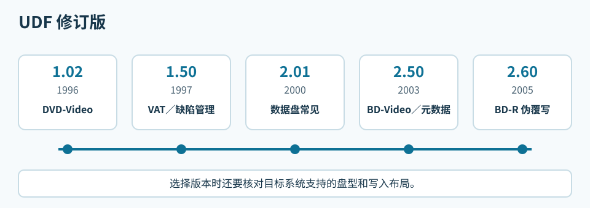

*常见 UDF 修订版的发布时间与用途。*

刻录软件可把 ISO 9660、Joliet、UDF 写在同一盘上。各目录对长文件名、大文件、特殊字符的处理可能不同，需在目标设备核对。现代 Windows、Linux、macOS 通常能读 UDF 数据盘；旧车机、播放器和系统须查具体版本。DVD-Video、BD-Video 则遵守各自的制作规范。[[S5]](#source-s5)[[S11]](#source-s11)[[S12]](#source-s12)

一般数据盘可参考：CD 用 Joliet 或 UDF 1.50，DVD 用 UDF 1.50／2.01，BD 用 UDF 2.50；DVD-Video 用 1.02，BD-Video 用 2.50，BD-R 伪覆写才涉及 2.60。给旧设备用时，以该设备的实际支持为准。直接改文件还要求合适的盘型和写入模式。

检查兼容性要过四关：光驱认识盘型和层数；系统找到会话；系统挂载文件系统；应用程序理解内容。数据 DVD 上的 `movie.mkv` 可在电脑浏览，旧 DVD 播放机却可能无法播放。VLC 选择“打开蓝光光盘”会按播放列表寻找影片，普通“打开文件”可能选错主片；商业 UHD 还涉及加密和导航。[[S5]](#source-s5)

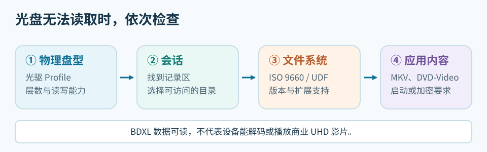

*四步分别对应介质、会话、文件系统和应用格式。*

### 3.3 ISO 镜像与普通文件

ISO 镜像保存已排好的盘面，可能包含 ISO 9660、UDF、El Torito 启动信息等结构；ISO 9660 本身是文件系统规范。ImgBurn 的 `Write image file to disc` 原样写镜像，`Write files/folders to disc` 则从文件新建盘面。把 `linuxmint.iso` 拖进数据盘只会得到一个文件；解压后再 Build 也可能丢失启动结构。[[S6]](#source-s6)

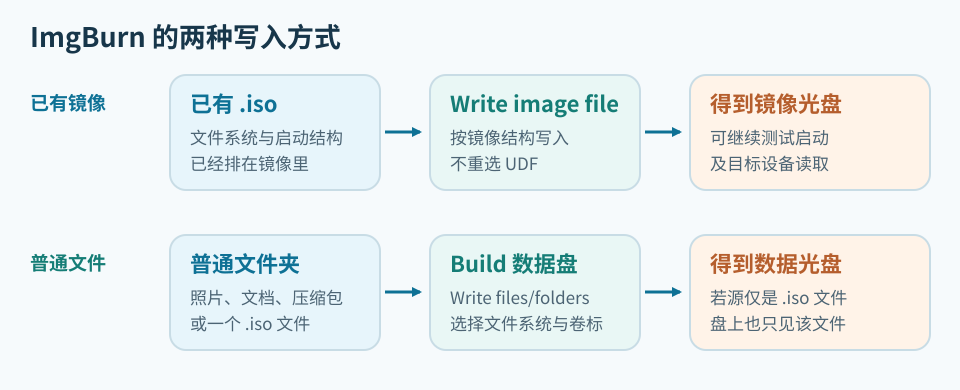

*制作安装盘选上方的镜像路线；归档普通文件选下方的文件路线。*

`BIN/CUE`、`IMG` 可能保存原始扇区或特殊轨道布局。普通 ISO 常为 `MODE1/2048`，原始映像可为 `MODE1/2352`；扩展名无法确定扇区长度，应看 CUE 和软件识别结果。复制普通数据盘无需把物理纠错字节另当文件写入。[[S5]](#source-s5)

### 3.4 扇区布局与纠错

CD 扇区主通道为 2352 字节，各模式留给应用的数据量不同：

| 结构 | 应用数据／扇区 | 用途 |
| --- | ---: | --- |
| CD-DA | 2352 字节音频采样 | 音频轨道和索引；有 CIRC 纠错及错误隐藏 |
| CD-ROM Mode 1 | 2048 字节 | 普通数据 CD，另有 EDC／ECC |
| CD-ROM Mode 2 | 可留更多主通道空间 | 基本模式；后续 XA 分为 Form 1／2 |
| XA Mode 2 Form 1 | 2048 字节 | 重视纠错的计算机文件 |
| XA Mode 2 Form 2 | 2324 字节 | VCD 视频流，以较少纠错冗余换容量 |

VCD 的目录和导航仍用 ISO 9660；Form 2 视频流也并非没有错误检测。CD-DA 按轨道而非文件目录组织音频。DVD、BD 通常每扇区有 2048 字节用户数据；DVD 的 ECC 块为 16 扇区、32 KiB，BD 相应单元为 32 扇区、64 KiB，采用 LDC／BIS 机制。扫描曲线还受光驱、速度和盘况影响。[[S9]](#source-s9)

### 3.5 Windows 的 Live 与 Mastered

Windows 的“像 U 盘一样使用”（Live File System）先建立 UDF，复制文件时逐步写盘。DVD-R 上保存同名新版，系统可能在新位置追加数据和目录，旧扇区仍占空间。DVD-R 没有 BD-R 的 Pseudo Overwrite（伪覆写）；BD-R 的这项机制需要介质、光驱和 UDF 2.60 布局配合，也不会回收旧扇区。DVD-RW 的 restricted overwrite 等模式则可重写相应区域。[[S10]](#source-s10)[[S11]](#source-s11)[[S12]](#source-s12)

“与 CD/DVD 播放器一起使用”（Mastered）先把文件放进“准备好写入光盘中的文件”，点击“刻录到光盘”才写入。待刻录区的 `desktop.ini` 多半是文件夹视图元数据。已刻文件不能直接在编辑器保存；追加新批次还要看会话和整盘状态。[[S4]](#source-s4)[[S10]](#source-s10)

“光盘标题”通常是卷标（volume label）；默认日期只是名称，不改变 MID 或续写状态。归档可用 `ARCHIVE_001` 等盘号，与盒子和索引对应。后续会话也可能另有卷标。

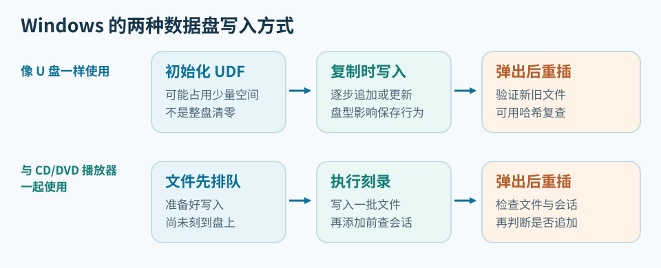

*两个选项都能制作数据盘，区别首先在写入时机和后续修改方式。*

选择窗口通常只在空白或擦除后的盘上出现。DVD-RW 擦除、重新初始化后可改用另一种方式。实际流程看测试文件：进入“准备好写入”就是 Mastered，须点“完成刻录”；复制后弹出重插即可读出，则是 Live。资源管理器可能残留旧的待刻录列表，因此要看新文件落在哪个区域。[[S10]](#source-s10)

换软件续写前，用测试盘确认它会导入旧目录，写后重插仍能读到两批文件。Windows、CDBurnerXP、ImgBurn 的布局和会话流程可能不同；两个程序也不要同时控制一台光驱。[[S10]](#source-s10)

<a id="windows-live-compatibility"></a>
#### 3.5.1 Windows Live 盘的读取兼容性

Windows Live 使用 UDF，但不固定为 2.60；盘型和初始化选项会影响版本与布局。读盘还要同时满足盘型／层数、会话状态及 UDF 驱动对 VAT、缺陷管理或伪覆写结构的支持。能读取文件也不等于能继续写入。[[S5]](#source-s5)[[S10]](#source-s10)[[S11]](#source-s11)[[S12]](#source-s12)

在制作盘的 Windows 电脑上，先弹出重插，检查新旧文件。换到另一台 Windows 电脑，先看光驱支持的盘型和层数，再打开样本文件；旧版 Windows 还可能不认识新版 UDF 或开放会话，可试另一台光驱。Linux、macOS 通常能读 UDF，但具体修订版、VAT 和开放会话仍需实盘测试，写入能力也要另测。家用播放器、车机则要按说明书核对数据盘文件系统、文件类型；DVD-Video／BD-Video 还须有规定的目录结构。

要交给别人读取，可在测试盘分两批写入小文件，在目标设备重插、读回并核对哈希。若读不到，改用设备支持的 UDF 版本，或制作封闭的 ISO 9660／Joliet／UDF 桥接盘。遇到格式化提示应取消，回制作盘的电脑导出数据。[[S5]](#source-s5)[[S10]](#source-s10)

<a id="erase-and-format"></a>
### 3.6 格式化、擦除与 zeroing

空白 DVD-R／BD-R 可直接用 ImgBurn 制作数据盘或写镜像，无须先 zeroing 或格式化。Windows Live 所说的“格式化”是在准备 UDF 和介质管理结构，不会使 R 盘变成可擦写盘。DVD-RW／BD-RE 则可擦除后重新使用；快速擦除可能只重置管理信息，Windows 的待刻录列表也未必随之清空。[[S10]](#source-s10)[[S11]](#source-s11)

“刻录光盘”窗口选的是 Windows 接下来的写入流程；资源管理器里的“格式化”则按选定 UDF 版本重新准备介质，通常形成直接复制的布局。因此，在选 Mastered 后又格式化，不能再按之前的选择判断当前写法。擦除本身也不决定使用 Live 还是 Mastered。

一次 DVD-RW 测试中，擦除后选 Live，文件却进了待刻录区；再次格式化后才能直接复制。另一次选 Mastered 后执行 UDF 格式化，也变成直接复制。仅凭界面无法确定前一次异常的具体原因。UDF 2.01 只标识版本，Mastered 数据盘也可能用 UDF；用可丢弃的小文件试写、弹出重插，才能确认实际流程。[[S10]](#source-s10)

切换 DVD-RW／BD-RE 的写法前，先备份、擦除并重插。选 Mastered 后直接加入测试文件，确认它进待刻录区，再“完成刻录”，中途不要格式化。选 Live 后等待初始化，确认测试文件直接写盘。若与预期不同，检查盘片状态和待刻录列表，从空盘重来。

R 盘不能通过格式化清除旧数据，RW／RE 的快速擦除也不保证无法恢复。Windows 若要求格式化有资料的盘，应取消，换回原光驱查盘型、会话和 UDF，并先复制可读文件。

DVD-R／BD-R 第一批数据和文件系统都已占用扇区。后续会话可写另一套目录，但若未导入旧文件，它们会从新目录视图消失。DVD-RW／BD-RE 若要更换布局，先备份，再擦除和初始化。

### 3.7 多会话与旧目录导入

Session（会话）是一批记录，可含一条或多条 Track（轨道）。下一批从后续可写地址开始，加入管理信息、数据和目录。新目录导入旧文件，两批便都可见；若只收录新文件，旧扇区还在，却不出现在当前目录。Microsoft 的 IMAPI 说明要求续写前导入上一会话的文件系统。[[S4]](#source-s4)

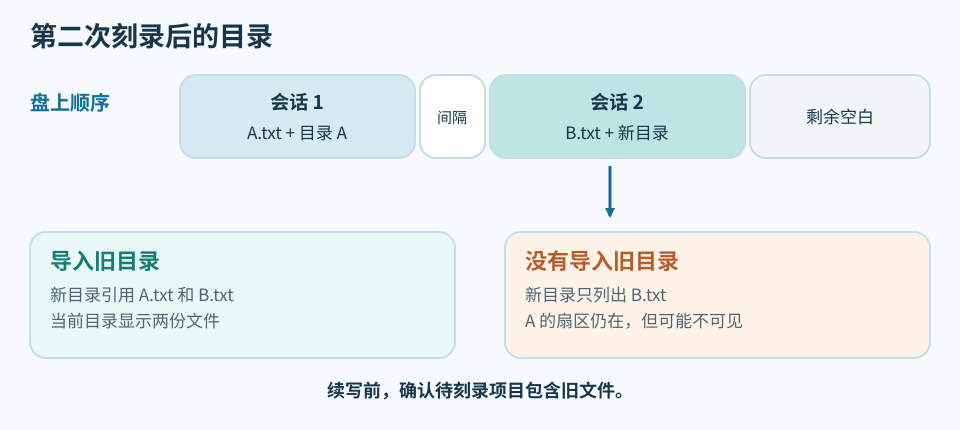

*第二会话的目录决定当前文件视图。旧会话未被导入时，旧扇区通常仍在盘上。*

“允许以后添加文件”只留下续写机会。CDBurnerXP 选“继续光盘／导入区段”后，须在下方待刻录项目看到旧文件；上方浏览窗显示 `G:` 还不够。若项目仍是 0 个文件，不要写第二批。一个 UDF 1.50 DVD-R 的失败例子见[写入行为记录](experiment-notes.md)。[[S4]](#source-s4)[[S10]](#source-s10)

ImgBurn Disc Information 的 `Status` 指整盘，`State of Last Session` 指最后会话。预留的下一会话可能显示 `Incomplete`，第一会话却仍可读；`Complete` 也要结合 R 盘或 restricted overwrite 模式解释。应合看 `Sessions`、Track、`Next Writable Address`、可擦写标记和重插读回。[[S10]](#source-s10)

资源管理器通常只显示当前挂载的文件目录，不提供逐个会话浏览；CDBurnerXP 的数据项目窗口也不是旧会话恢复器。要找第一会话，先停止写盘，用能列出会话起点的工具检查盘面。Linux 的开源 `xorriso` 可以查看和提取 ISO 9660 会话；盘若只有 UDF 目录，或会话本身不完整，它未必能还原文件。IsoBuster 可用于检查多会话，但部分恢复功能收费。先只读复制能找到的文件，别为了找旧目录再次格式化或追加。[[S10]](#source-s10)

### 3.8 关闭轨道、会话与整盘

Close Track 结束一条轨道，Close Session 完成当前会话，Finalize／Close Disc 则关闭整张一次写入盘的追加状态。软件的中文界面可能把几种操作都叫“封盘”；看原英文和写后的 Disc Information 更可靠。会话关闭后仍可能继续下一批，整盘最终化后通常无法再添加文件。ImgBurn 作者确认，Build 模式没有日后继续追加普通文件的多会话流程。[[S4]](#source-s4)[[S6]](#source-s6)[[S7]](#source-s7)

重要备份可先在硬盘集齐文件，一次刻录后做 Verify、重插和哈希核验。确实要分批时，每批用 `S01_日期`、`S02_日期` 等独立目录和各自的校验表。频繁写入几 KB 的小会话会占用管理空间，日后也更难分辨哪一版文件有效。

## 四、购买光驱和盘片

### 4.1 光驱的写入与 UHD 读取能力

2026 年 8 月，按全新、有保修、开箱即用筛选，并优先看官方旗舰店或平台自营，以下两款外置机的参考价为：

| 设备 | 当时报价 | 可能的机芯及规格 |
| --- | --- | --- |
| ASUS `BW-16D1H-U` | 约 1499 元 | 5.25 英寸厚机；可能装 `BW-16D1HT` 或 Pioneer `BDR-209MBK` OEM，标称 BDXL |
| UGREEN `CM780` | 约 799 元 | USB 薄机；可能装 `BU40N` 衍生机芯，标称 BDXL |

同名外壳可能换机芯，购买时以实机 ID、固件和可写 Profile 为准；薄机还需留意尺寸与 USB 供电。价格和售后也要按当下渠道重查。

2026 年 8 月，二手 CD／DVD 机的入门预算约 200 元，蓝光数据刻录约 1000～2000 元。二手机的激光器、托盘状态未知，先用测试盘刻录、Verify、重插读回。

按将使用的盘型查可写 Profile：DVD 的 `+`／`-`、RW、DL、RAM，BD 的 25／50 GB，BDXL 的 100／128 GB 都要分开核对。连续刻录优先考虑散热、供电更充足的 5.25 英寸机芯。

要读 4K UHD，可按 [MakeMKV 社区清单](https://forum.makemkv.com/forum/viewtopic.php?f=16&t=19634)向卖家索取实机标签和 Drive Information，核对机芯、生产日期、`MT1959`、LG `NS50/NB50` 服务码和固件；外置产品还要查内部机芯与 USB 桥接。Pioneer 指定机型的新固件可能封住跨刷路径。[[S3]](#source-s3)

数据刻录看写入 Profile 和 Verify；MakeMKV 原始读取看 LibreDrive；商业 UHD 播放还涉及 AACS 2.x 与播放软件。已满足用途的固件无须为改速度而跨刷，某些跨刷会损失写入能力。[[S3]](#source-s3)

### 4.2 盘片产地与产品系列

盘型决定容量和记录方式；产地、制造商声明、商品号、MID 及内圈码用于追溯批次。

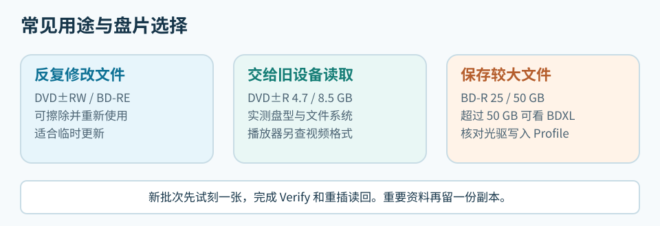

*按用途选择盘型后，再比较品牌、批次与价格。*

#### 4.2.1 产地、品牌与实际制造商

日本、台湾、中国大陆、印度、阿联酋等地都生产过可录光盘；品牌所属地不一定是制造地。太阳诱电、松下、索尼、三菱的历史日本原产盘有好口碑，台湾厂也有合格产品。CMC、RITEK 和威宝各有多条产品线。买盘时记录商品号、包装产地与厂商声明、MID、内圈码；条码前缀和珍宝盒手感不足以鉴定工厂。[[S2]](#source-s2)[[S8]](#source-s8)

威宝跨三菱与 CMC 时期可能共用 `VERBAT IMe`；43714 的具体样本及三菱商标声明见 1.5 节。太阳诱电（Taiyo Yuden）曾是重要的 CD-R／DVD-R 制造商；其旧库存、JVC 盘和 CMC Pro 要分别查来源和存放年月。紫晶存储等企业级光存储采用专门的设备和介质，不属于普通空白盘市场。

#### 4.2.2 CD、DVD 与 BD 候选系列

CD-R 可查铼德 Excellent、Demo Audio、Medical Data，三菱／威宝历史 AZO 系列，以及太阳诱电旧库存。Demo、Medical 是系列名，不是寿命认证。寻找酞菁染料或金反射层，应查厂商材料说明。[[S8]](#source-s8)[[S9]](#source-s9)

4.7 GB DVD 可查 RITEK Excellent（双 X）、威宝 AZO、DVD M-DISC，或明确公布反射层材料的 Gold DVD-R。AZO 是染料，DVD M-DISC 还需相应写入策略。8.5 GB DVD+R DL 应少量试刻、检查跨层读取；大文件较多时也可比较 BD-R 的单位容量价格。[[S8]](#source-s8)[[S9]](#source-s9)

25 GB BD-R 可查 Verbatim Hard Coat、索尼／松下历史系列和铼德 `RITEK BR2／BR3`；后两者是 4×／6× HTL 代码，不代表质量等级。50 GB BD-R DL 可查威宝、铼德和 BD M-DISC：Juri 收录的 `DBR50RMDPV1` 为 `VERBAT IMf`。100 GB 有 `DBR100YMDPV1 / VERBAT IMk` 等历史样本；128 GB 须明确标注四层。买多层盘先查光驱可写 Profile 和目标设备读盘能力。BD-RE 可用于临时更新，按容量和实际写速购买。[[S2]](#source-s2)[[S9]](#source-s9)

Juri 的[BD-R 目录](http://juri.su/bdr.htm)收录了标为 2011、2016 年的威宝 `43714 / VERBAT IMe`，以及 2016 年的 `43840 / CMCMAG BA5`：商品号相近也可能跨年代、跨 MID。[[S9]](#source-s9)

[ez647 的 JVC 记录](https://ez647.sk/jvc.html)包括 DVD-R `TYG03`，BD-R `MEI T01` HTL、`TYG BD Y03` 和 `JVC AM S6L` LTH。只看 JVC 商标无法判定记录层。[[S8]](#source-s8)

铼德／Ridata 的经济线、Excellent 和 M-DISC 是不同系列；DVD 的“双 X”与 BD-R 的 `BR2/BR3` 无对应关系。ez647 一张 Imation 品牌 BR2 的 385 天读盘失败记录见 1.6 节；单盘案例不能推算整类盘的失效率。[[S2]](#source-s2)[[S8]](#source-s8)

[Juri 的汇总表](http://juri.su/bdrtest.htm)中，Ritek `BDR25 / BR2` 为 4×、平均 LDC／BIS `135.62 / 2.10`、`Data` 日期 2016-11-26；RiDATA `BDR25 / BR3` 为 6×、`78.91 / 1.42`、2016-12-25。盘片标为 2023 年的 Mirex `BR3` 则为 `14.89 / 0.27`，测试机已更换。表未分别说明刻录日和扫描日，批次、写速也不同。这些是单盘记录，整桶购买前仍要用自己的设备试刻、读回。[[S9]](#source-s9)

[Juri 的 CD-R 目录](http://juri.su/cdr.htm)中，威宝 `43347` 的 2007 年印度样本 ATIP 指向 Moser Baer，2016 年中国样本指向 CMC。[DVD 目录](http://juri.su/dvdr.htm)里，威宝 `43465` 是日本产 `TYG02`，`43580` 是台湾产 `MCC 02RG20`。比较品牌系列时应保留商品号、年代、产地和实盘标识。[[S9]](#source-s9)

BD M-DISC 与 DVD M-DISC 的材料路线不同；购买前查可写 Profile 和兼容表，再试刻一张。[[S9]](#source-s9)

### 4.3 写入速度与质量检查

“CD 不超过 16×、DVD 不超过 8×、BD 不超过 4×”可当试刻起点，不是统一最佳速度；三种介质的 4× 数据率也不同。新批次选双方支持的中档速度，Verify、重插读回，调整速度后再比较结果。高速盘强制用极低速度未必更好。

连续出错时，用已知良盘或另一台光驱交叉检查。质量扫描要固定设备与速度；目录和会话也须留空间，但没有统一留白比例。重要文件比对 SHA-256，条件允许时异机读回。

可擦写盘还须确认目标设备支持 RW、RE 或 RAM；旧播放器可能不认盘型或较低反射率。

### 4.4 采购数量和到货测试

按资料容量和第二副本计算数量，另留一两张试刻。已有的盘足够做首轮备份，就先写入、校验，再按新增资料补货；整桶购买前先确认批次。

以 2026 年的一组零售报价为例，25 GB × 50 张约 92 元，50 GB × 50 张约 333 元，名义容量价分别约 0.074 元/GB 和 0.133 元/GB；前者约便宜 45%。计算备份成本时，还应计入失败盘、包装、异机读盘和第二份副本。连续 40 GB 的大文件用 50 GB 盘省去分卷；能按 20 GB 自然分批的资料，用 25 GB 盘更灵活。

到货后留包装照片、商品号、产地和厂商声明，记 MID、极性、层数及速度；样本盘附刻录日志、Verify、重插读回和哈希。**盘片标注年份、刻录日、首次扫描日、复测日**要分开记录。固定条件的质量曲线及异机读回可供日后比较。空白盘可能无法做 Disc Quality 扫描；`Discovery` 和 `Create Test Disc` 会消耗测试盘。借用 ez647、Juri 的旧图时，先查日期含义和扫描条件；没有刻录日便不能推算写后存放年数，曲线相似也不足以鉴定工厂。[[S8]](#source-s8)[[S9]](#source-s9)

## 五、刻录与读回校验

以下用 `G:` 代表光驱，用 `D:\归档\ARCHIVE_001` 代表源文件夹，操作时换成实际路径。有资料的盘先只读检查，必要时把文件复制到硬盘，再考虑写入、格式化或擦除。

### 5.1 从空盘到首次校验

普通文件备份可先在硬盘整理完整快照，再一次写到空白盘，读回校验并保存清单。每张盘给唯一编号，如 `ARCHIVE_001`，写在盒脊、盘面可写区域和电子索引里。完整 ISO 用 5.3 节；分批追加用 5.4 或 5.6 节；需反复修改则用可擦写盘，按 5.7 节测试。制作 DVD-Video／BD-Video 要用相应编排软件。[[S10]](#source-s10)

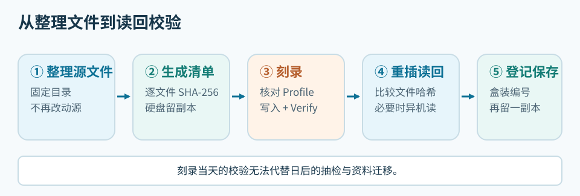

*写盘后弹出重插，再核对哈希并保存第二份副本。*

### 5.2 用 ImgBurn 刻录普通文件

1. 在硬盘建立 `D:\归档\ARCHIVE_001\DATA`，放入待备份文件，刻录开始后不再修改。大量压缩包应附目录说明；重要资料按用途分包，保留原文件索引，以免一个包损坏牵连全部。
2. 在 `ARCHIVE_001` 根目录写 `README.txt`，记录盘号、日期、来源、目录、工具和写速。按 5.8 节生成逐文件 `SHA256.csv`，硬盘另存一份。清单放在 `DATA` 外，避免计算自身哈希。
3. 检查容量：4.7 GB DVD 在 Windows 约为 4.38 GiB，25 GB BD 约为 23.3 GiB；还要留文件系统和管理空间。新批次别填满。
4. 放入空白盘，关闭 Windows 格式化提示。ImgBurn Disc Information 应显示正确的 `Current Profile`、`Status: Empty`、层数、容量、MID 和速度；若已有会话，先查明盘片。

~~~text
D:\归档\ARCHIVE_001\
├─ README.txt
├─ SHA256.csv
└─ DATA\
   ├─ Photos\
   ├─ Documents\
   └─ Project_A.zip
~~~

5. 在 ImgBurn 选 `Write files/folders to disc`（Build），将整个 `ARCHIVE_001` 文件夹加入 Source。若只见 `Show Disc Layout Editor`，打开它排目录，或在 `Input` 菜单切到 `Standard`。预览盘根：加入整个文件夹后应是 `G:\ARCHIVE_001\...`；只加入内部文件则会改变根目录。
6. 在 Options 选目标设备支持的 UDF 或桥接文件系统；Labels 填 `ARCHIVE_001`。Device 选刻录机和双方支持的写速，新批次先试中档。勾选 Verify，核对文件数、容量和目的光驱，再写盘。[[S6]](#source-s6)
7. 写完且 Verify 通过后，弹出重插，核对文件数和大小，从盘上打开不同位置的文件，并比对重要文件或全部文件的 SHA-256。
8. 在硬盘索引中记录盘号、盘片型号／MID、光驱与固件、写速、Verify 和哈希结果。独立入盒，避开热源、日晒和潮湿；不可替代的资料另存异地或不同介质副本，隔几个月或一年抽检。

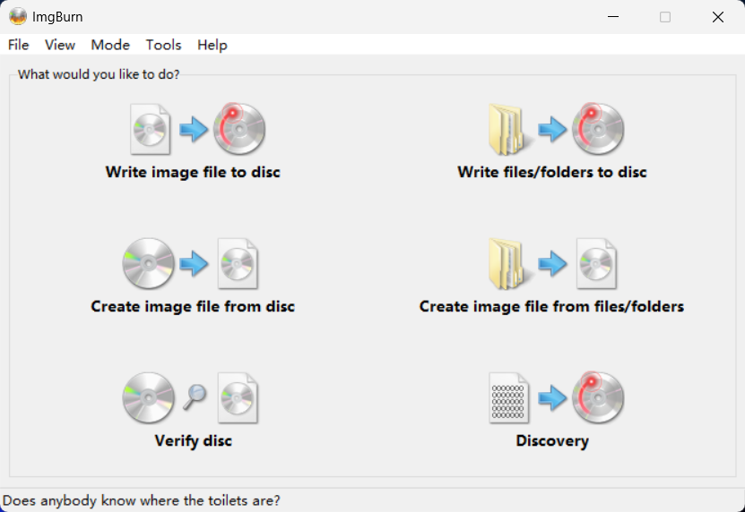

*ImgBurn 主界面：普通文件选右上角的 `Write files/folders to disc`；已有 ISO 选左上角的 `Write image file to disc`。*

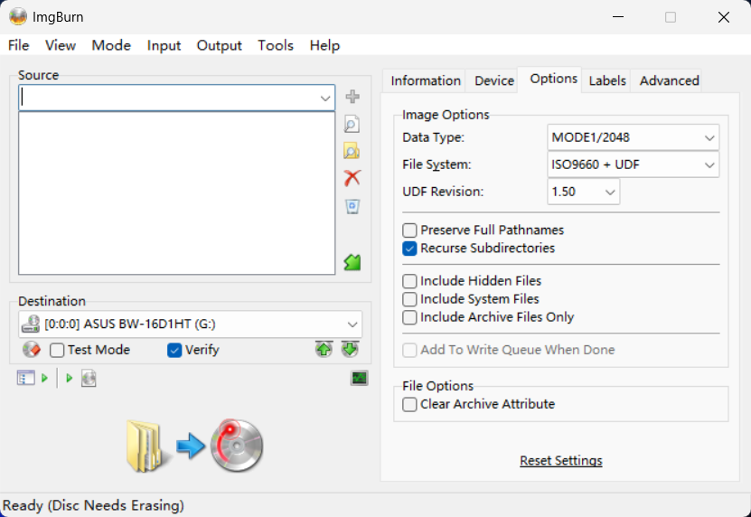

*`Options`：设置文件系统与 UDF 版本。截图中尚未加入源文件，DVD-RW 也提示需擦除。*

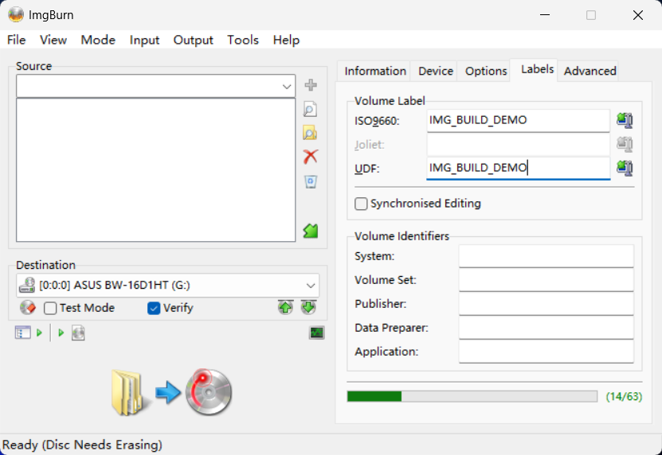

*`Labels`：桥接盘须检查 ISO 9660 与 UDF 两处卷标；截图仍未加入源文件。*

### 5.3 用 ImgBurn 写入 ISO 镜像

从发布方取得 ISO 和 SHA-256，核对下载文件与盘片容量。放入空白盘，关闭 Windows 的写盘提示；在 ImgBurn 选 `Write image file to disc`，Source 指向 ISO，Destination 选光驱，设支持的速度并勾选 Verify。写后弹出重插；安装盘还须在目标电脑试启动。镜像已有文件系统，不必另选 UDF；若盘上只有一个 `.iso` 文件，就是误用了普通文件刻录。[[S6]](#source-s6)

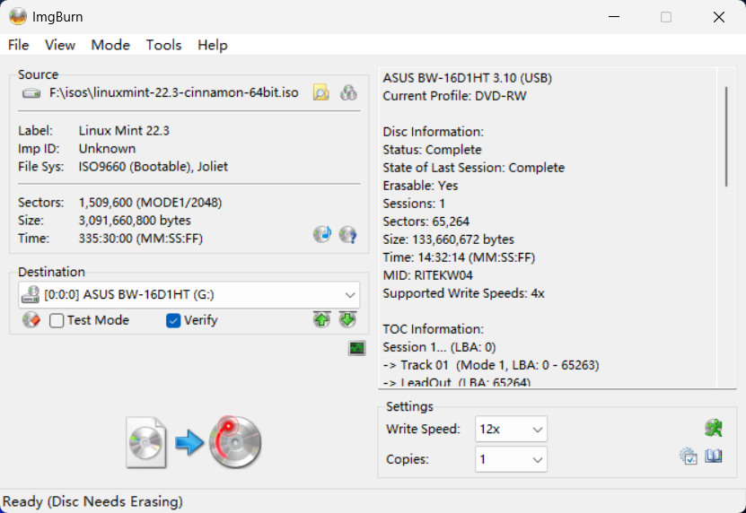

*Source 选 ISO，Destination 选光驱并勾选 Verify。图中 DVD-RW 已有数据（`Disc Needs Erasing`）；光驱列出 4×，选择框却显示 12×，正式写入前须核对。*

### 5.4 用 Windows Live 分批写入

1. 放入空白盘，输入卷标，选“像 U 盘一样使用”，等 Windows 初始化。DVD-RW 若刚切换写法，先擦除并重插；已有文件需要保留时取消操作。
2. 从硬盘复制可丢弃的 `S01_test.txt`。若文件进入“准备好写入到光盘中的文件”，当前仍是待刻录流程，先停下。若直接写入，弹出重插并核对内容。
3. 后续批次放进 `S02_日期` 等目录。每批都重插，同时打开第一批与新增文件。
4. 要直接修改盘上文件，再用 `edit_test.txt` 试验：编辑器保存后重插，比对 SHA-256，别只看时间戳。DVD-R、DVD-RW、BD-RE 的结果可能不同。

选 Live 并完成初始化后，通常无须再点“格式化”。若文件仍进待刻录区，先停下；确认介质允许重新格式化、旧数据无需保留，再重新初始化，并用测试文件验证。

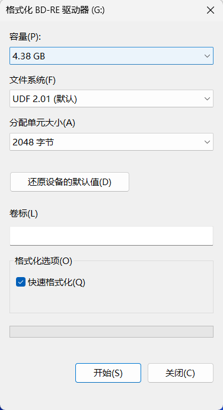

*4.38 GB 可擦写盘的 UDF 格式化窗口。标题中的“BD-RE 驱动器”是光驱名称，不代表盘型；有资料要保留时不要点击“开始”。*

某些 DVD-R 组合允许保存同名新版，但旧扇区不会回收。经常改文件可选 DVD-RW／BD-RE，或在硬盘改好再刻新快照。交给另一台电脑前，按[Windows Live 兼容性检查](#windows-live-compatibility)测试读回；若对方要求格式化，应取消并回原电脑导出。[[S5]](#source-s5)[[S10]](#source-s10)[[S12]](#source-s12)

### 5.5 用 Windows Mastered 刻录文件

1. 放入空白盘，选“与 CD/DVD 播放器一起使用”，填写卷标。复用 DVD-RW／BD-RE 时，先保存旧资料、擦除、重插。选 Mastered 后不要再点“格式化”。
2. 将文件拖入光驱窗口，确认它进入“准备好写入到光盘中的文件”；若直接写盘，按[格式化与擦除](#erase-and-format)检查状态。
3. 核对待刻录列表的文件名、数量，移出不需要的 `desktop.ini`。
4. 在 Windows 11 的“更多选项”中点“完成刻录”，确认卷标和速度，点“下一页”开始写盘。
5. 成功后弹出重插，从盘上打开文件并比对哈希。

这仍是数据盘；目标播放器须支持盘上的文件类型。若要续写，先查会话和整盘状态，再确认软件能导入旧目录。[[S4]](#source-s4)[[S5]](#source-s5)[[S10]](#source-s10)

### 5.6 用 CDBurnerXP 续写会话

第一次在 CDBurnerXP 数据盘项目中加入 `S01_日期`，结尾选“保留以后追加”。Verify、弹出重插，打开第一批文件。第二次选“继续光盘／导入区段”，确认**下方待刻录项目**已有 `S01`，再加 `S02_日期`。上方浏览区能看到旧盘，不代表项目已导入；若下方仍为 0 个文件，停止刻录，检查软件与文件系统兼容性或换新盘。[[S4]](#source-s4)[[S10]](#source-s10)

第二批写完，再 Verify、重插并校验两批文件。此后每批重复。确定不再续写或目标设备要求时，先核对所有批次都在目录中，再选 Finalize／Close Disc。几 KB 的小会话会浪费管理空间，可按周或主题凑批。

### 5.7 擦写 DVD-RW 与 BD-RE

先把旧数据复制到硬盘并验证。选 Windows Live UDF 或经测试的可读写方式，依次试写、重插、编辑、再重插，并删除另一个测试文件，查看目录和可用空间。需要重来时执行“擦除此光盘”、初始化并重插。快速擦除不等于安全抹除。[[S10]](#source-s10)

DVD-RW 的受限覆写模式可修改和删除文件；能否直接在编辑器保存，须按软件测试。[[S10]](#source-s10)

### 5.8 生成并核对 SHA-256 清单

SHA-256 清单逐文件记录相对路径与哈希；分批盘可为第二批单独建 `SHA256_S02.csv`。以下脚本只计算 `DATA`，把清单写在外层，避免算入自身：

```powershell
$dataRoot = 'D:\归档\ARCHIVE_001\DATA'
$prefix = (Resolve-Path -LiteralPath $dataRoot).Path.TrimEnd('\') + '\'
Get-ChildItem -LiteralPath $dataRoot -File -Recurse |
  Sort-Object FullName |
  ForEach-Object {
    [pscustomobject]@{
      Path = $_.FullName.Substring($prefix.Length)
      SHA256 = (Get-FileHash -LiteralPath $_.FullName -Algorithm SHA256).Hash
    }
  } |
  Export-Csv -LiteralPath 'D:\归档\ARCHIVE_001\SHA256.csv' -NoTypeInformation -Encoding UTF8
```

写盘、重插后，从 `G:\ARCHIVE_001\DATA` 逐文件重算哈希。匹配说明此次读出的字节与写前一致；Verify 是刻录软件的读回检查。若失败，保留硬盘原件和日志，检查目录与盘况，再决定是否重刻。[[S10]](#source-s10)

```powershell
$discData = 'G:\ARCHIVE_001\DATA'
$bad = foreach ($row in Import-Csv -LiteralPath 'G:\ARCHIVE_001\SHA256.csv') {
  $file = Join-Path $discData $row.Path
  if (-not (Test-Path -LiteralPath $file) -or
      (Get-FileHash -LiteralPath $file -Algorithm SHA256).Hash -ne $row.SHA256) {
    $row.Path
  }
}
if ($bad) { $bad } else { '全部文件的 SHA-256 均匹配' }
```

### 5.9 质量扫描与常见故障

ImgBurn Discovery 会写测试数据，消耗空白盘，不接受待归档文件。质量扫描只覆盖已写区域；要看外圈或跨层区，就要写到相应位置并完整读取。档案盘可做非破坏性扫描；`No suitable disc inserted` 也可能只是光驱不支持 BD 扫描命令。备份的可用性优先看 Verify、文件哈希、连续读取及异机读盘。[[S6]](#source-s6)[[S8]](#source-s8)[[S9]](#source-s9)

| 看到的现象 | 先做的只读检查 |
| --- | --- |
| 空白盘在资源管理器打不开 | ImgBurn 查 `Current Profile`、`Status: Empty`；空白盘尚无目录 |
| 出现 `desktop.ini` 和“准备好写入” | 检查是否还没点“刻录到光盘” |
| 已占空间却看不到文件 | 查会话、最后目录与文件系统，暂不格式化 |
| 最后会话 `Incomplete` | 查第一会话、轨道和读回；可能只是预留的空白会话 |
| DVD-R 能新增却不能保存旧文件 | 在硬盘改好新版，换新文件名追加 |
| 新会话后旧目录消失 | 停止写入，用会话工具只读检查旧目录是否导入 |
| `Verify` 失败或哈希不一致 | 保留源文件与日志，另用一张盘重刻 |
| 另一电脑要求格式化 | 取消，回原电脑导出；查盘型、UDF 版本和光驱 |

## 六、资料来源

网络资料核查于 2026-10-06。标准与软件用语以规范、作者说明为准；论坛扫描和盘片目录只记录具体样本。

<a id="source-s1"></a>**[S1] Bedcore《数据光盘刻录理论入门》V1.0.2。** [Bilibili 视频](https://www.bilibili.com/video/BV1itur6qExK/)，基础文档标注 2026-08-15，19 页，CC BY-SA 3.0。本指南改写了文字、章节和图示；第二章的 20 幅机芯照片及标志图取自基础文档。商标归各权利人。

<a id="source-s2"></a>**[S2] 蓝光协会 MID 名录。** [Disc Manufacturer ID & Media Type ID Licensee List](https://blu-raydisc.info/licensee-list/discmanuid-licenseelist.php)。按盘型、层数列出授权 MID、速度和 HTL／LTH；`VERBAT IMe` 同列于 CMC 与 Mitsubishi Chemical Media 名下。

<a id="source-s3"></a>**[S3] MakeMKV 社区指南。** [Ultimate UHD Drives Flashing Guide Updated 2026](https://forum.makemkv.com/forum/viewtopic.php?f=16&t=19634)，首帖的驱动器、固件、*sleep bug* 与跨刷章节。社区路线须按实机平台、服务码和当前帖文核对。

<a id="source-s4"></a>**[S4] Microsoft 多会话说明。** [Microsoft：Creating a Multisession Disc](https://learn.microsoft.com/en-us/windows/win32/imapi/creating-a-multisession-disc)。说明如何导入上一会话文件系统，以及会话与关闭状态的关系。

<a id="source-s5"></a>**[S5] Microsoft 格式概览。** [Microsoft：Disc Formats](https://learn.microsoft.com/en-us/windows/win32/imapi/disc-formats)。概述 ISO 9660、Joliet、UDF 与桥接盘。

<a id="source-s6"></a>**[S6] ImgBurn 功能。** [ImgBurn 官方 Features](https://www.imgburn.com/index.php?act=features)。列出 Read、Build、Write、Verify、Discovery 的用途。

<a id="source-s7"></a>**[S7] ImgBurn 作者答复。** [ImgBurn Forum：NOT finalizing the CD when in build mode?](https://forum.imgburn.com/topic/3859-not-finalizing-the-cd-when-in-build-mode/)，2007-04-13。作者说明 ImgBurn 没有 Build 后继续添加普通文件的多会话流程。

<a id="source-s8"></a>**[S8] ez647 盘片资料库。** [介质总目录](https://ez647.sk/media.html)、[Verbatim `VERBAT-IMe-000`](https://ez647.sk/mitsubishi_kagaku/verbatime000bdr.html)、[RITEK BR2](https://ez647.sk/ritek/ritekbr2000_bdr.html)、[JVC 记录](https://ez647.sk/jvc.html)。单盘页提供包装、内圈码和复测日期。

<a id="source-s9"></a>**[S9] Juri 单盘记录。** [BD-R 索引](http://juri.su/bdr.htm)、[LDC／BIS 汇总](http://juri.su/bdrtest.htm)、[LTH／HTL 户外对照](http://juri.su/lthhtl.htm)、[CD-R](http://juri.su/cdr.htm)、[DVD](http://juri.su/dvdr.htm)、[M-DISC](http://juri.su/mdisc.htm)。汇总表的 `Data` 日期未拆成刻录日与扫描日；户外对照则明确给出写入和最终测试日。

<a id="source-s10"></a>**[S10] 写入行为记录。** [DVD-R 与 DVD-RW 的三盘实验](experiment-notes.md)：介质、软件版本、步骤及重插读回结果。

<a id="source-s11"></a>**[S11] 卷与文件结构标准。** [Ecma International：ECMA-167](https://ecma-international.org/publications-and-standards/standards/ecma-167/)。提供光介质卷和文件结构的标准背景。

<a id="source-s12"></a>**[S12] UDF 实现文档。** [udftools：mkudffs(8)](https://man7.org/linux/man-pages/man8/mkudffs.8.html)，列有各 UDF 修订版与介质选项。

<a id="source-s13"></a>**[S13] 加拿大文物保护研究所保存指南。** [CCI Notes 19/1：Longevity of Recordable CDs and DVDs](https://www.canada.ca/en/conservation-institute/services/conservation-preservation-publications/canadian-conservation-institute-notes/longevity-recordable-cds-dvds.html)，表 2 及保存建议；表中排名未计入污染物，建议温湿度不是统一测试条件。

<a id="source-s14"></a>**[S14] CD 与 DVD 盘体结构。** Fred R. Byers，[《Care and Handling of CDs and DVDs》](https://www.clir.org/wp-content/uploads/sites/6/pub121.pdf)，Council on Library and Information Resources／NIST，2003，第 3 章及图 1～11。说明 CD 顶面的薄漆和反射层、DVD 的双基板、只读盘凹坑、有机染料和相变膜。书中尚未涉及后来的可刻录双层 DVD。

<a id="source-s15"></a>**[S15] BD-ROM 物理结构。** Blu-ray Disc Association，[《White Paper Blu-ray Disc Format, 1C: Physical Format Specifications for BD-ROM》](https://web.archive.org/web/20110928104732id_/https://www.blu-raydisc.com/Assets/Downloadablefile/BD-ROMwhitepaper20070308-15270.pdf)，第 1、4 章：约 1.1 mm 基板、约 0.1 mm 覆盖层，双层盘约 0.025 mm 透明间隔层；硬涂层可选。

<a id="source-s16"></a>**[S16] BD-R 物理结构。** Blu-ray Disc Association，[《White Paper Blu-ray Disc Format: BD-R Physical Format, 3rd Edition》镜像](https://blog.ligos.net/images/The-Reliability-Of-Optical-Disks/BD-R_Physical_3rd_edition_0602f1-13322.pdf)，第 2.2 节及图 2.2.2、2.6.3。列出有机与无机记录材料示例，单层记录区距读盘面约 100 µm，双层 L1／L0 分别约 75／100 µm。

<a id="source-s17"></a>**[S17] 可刻录双层 DVD。** Verbatim／Mitsubishi Kagaku Media，[《DVD+R DL White Paper》](https://www.cdrom2go.com/dvd-plus-r-dl-white-paper)，Double Layer Disc Structure 与各层说明。以该厂家早期 DVD+R DL 为例，说明半透 L0、透明间隔层、L1 染料与反射层。不同厂商及 DVD-R DL 不应照此认定具体薄膜配方。

<a id="source-s18"></a>**[S18] BD-RE 与三层 BDXL。** Blu-ray Disc Association，[《White Paper Blu-ray Disc Format, 1A: Physical Format Specifications for BD-RE》](https://web.archive.org/web/20200411111052id_/http://www.blu-raydisc.com/Assets/Downloadablefile/White_Paper_BD-RE_5th_20180216.pdf)，第 2～4 章。说明相变记录、100／75 µm 的单层与双层层位，以及 BD-RE 三层 100／75／57 µm 的示例。

---

## 仓库维护

README 和网页由 `chapters/*.md` 生成。修改正文后运行：

```bash
npm ci
npm run build
npm run check
```

`build.cjs` 生成 `content.md`、`README.md`、两张 HTML 页面和图示。网页资源位于 `assets/`，GitHub Pages 从 `main` 分支根目录发布。`qa/` 和 Bedcore 的原版 PDF、HTML 不纳入仓库。

[站点地图](https://nanocm.github.io/optical-disc-writing-guide/sitemap.xml)包含主页和写入行为记录页。需要查看 Google 收录情况时，可在 Search Console 添加网址前缀属性 `https://nanocm.github.io/optical-disc-writing-guide/`，验证后提交站点地图。
